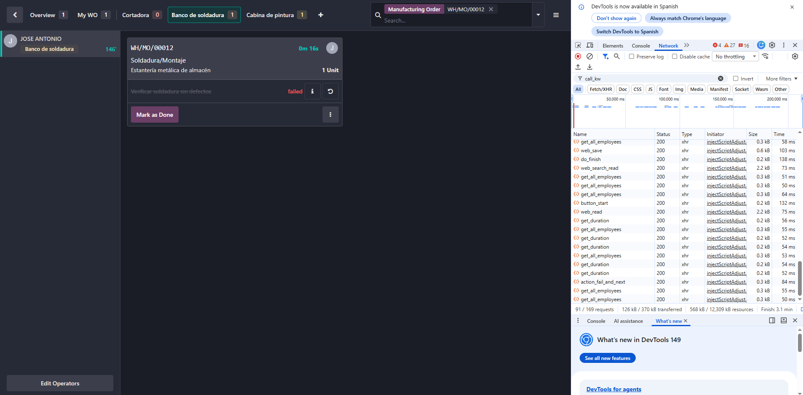

# Odoo Quality Control — Hard Stop

## El problema-

En Odoo Manufacturing, un Quality Point tipo **Pass-Fail** no bloquea la producción por diseño. Forzar un `Fail` en un Quality Check deja la orden de fabricación avanzar exactamente igual — sin bloqueo ni advertencia. Confirmado con el foro oficial de Odoo: el único bloqueo nativo real es el botón manual "Block" del Work Center en Shop Floor, decisión humana, no automática.

## Intento 1: Automation Rule con trigger equivocado

Primera solución: una Automation Rule sobre el modelo `Quality Check`, con `Execute Code` lanzando un `UserError` cuando el estado pasa a Failed.

El código se ejecutaba — pero no en el momento del fallo. El trigger elegido, **"After last update"**, pertenece a la categoría *Based on Date Field*, y se procesa vía la Scheduled Action "Automation Rules: check and execute", programada cada 4 horas por defecto en esta instancia.

Confirmado forzando "Run Manually" en esa Scheduled Action: el `UserError` se disparaba correctamente, con hasta 4 horas de retraso — inútil como freno real de producción.

## Diagnóstico: cómo se dispara el Fail realmente

Antes de cambiar el trigger, había que confirmar cómo se genera el Fail en el flujo real de producción (Shop Floor / tablet), no solo desde el backend.

Con la pestaña **Network** del navegador abierta al pulsar el botón de Fail en Shop Floor, se confirma que la acción llama a un método interno: **`action_fail_and_next`** — no un `write()` genérico sobre un formulario.



Esto descarta el trigger **"On UI change"** (solo reacciona a ediciones manuales de campo en formulario) y apunta a un trigger síncrono a nivel ORM.

## Un obstáculo adicional: datos de prueba sin resolver

Antes de validar la solución, apareció un falso positivo: la regla se disparaba sobre Quality Checks antiguos, ya en Failed desde sesiones de prueba anteriores, sin relación con la MO que se estaba creando.


Causa: el domain de la Automation Rule estaba en "Match all records", sin restricción por estado, y el campo "When updating" estaba vacío — la regla se ejecutaba en cualquier escritura sobre cualquier Quality Check, no solo en la transición hacia Failed.

## Intento 2 (solución): trigger "On create and edit"

Configuración final, corrigiendo ambos problemas:

- **Trigger:** `On create and edit` (hook síncrono sobre el ORM, sin pasar por cron)
- **Before Update Domain:** `[("quality_state", "!=", "fail")]`
- **Apply on domain:** `[("quality_state", "=", "fail")]`
- **When updating:** campo `Status` (`quality_state`)

```python
if record.workcenter_id:
    record.workcenter_id.write({'working_state': 'blocked'})
if record.workorder_id:
    raise UserError("Quality Check failed: no se puede continuar sin resolver el defecto.")
```


## Verificación

**1. Backend** — Quality Check marcado Failed manualmente:


**2. Shop Floor** — Fail forzado desde el botón real de producción (`action_fail_and_next`), el escenario que realmente importa:


En ambos casos, la orden de fabricación se frena al instante, sin retraso de cron.

## Límite descubierto: el bloqueo del Work Center no persiste

El código también intenta bloquear el Work Center compartido (`working_state = 'blocked'`), para avisar de que ese recurso físico tiene un defecto pendiente, independientemente de qué orden o producto lo use después.

Esa escritura no persiste. El chatter registra "AUTOMATION FIRED: Quality Check failed", pero el campo `working_state` nunca cambia:


**Causa probable:** el `raise UserError` provoca un rollback de la transacción completa. El `write()` sobre el Work Center, ejecutado antes del `raise` en el mismo bloque de código, se revierte junto con él — mientras que el log del chatter parece persistir por un mecanismo de registro separado.

## Conclusión

| Capa | Estado |
|---|---|
| Bloqueo de la orden puntual (MO) | ✅ Resuelto — automático y síncrono |
| Bloqueo del recurso compartido (Work Center) | ❌ No resuelto — requiere el botón manual "Block" |
| Bloqueo por lote/material específico | Fuera de alcance — mecanismo distinto (`stock.lot`), no cubierto aquí |

El objetivo principal (frenar la orden de fabricación cuando un control de calidad falla) está resuelto de forma nativa, sin desarrollo custom más allá de una Automation Rule con Execute Code. El bloqueo del recurso físico compartido sigue siendo, por diseño de transacciones en Odoo, una decisión humana.

---

Serie completa en LinkedIn: [Post 1] · [Post 2] · [Post 3]
